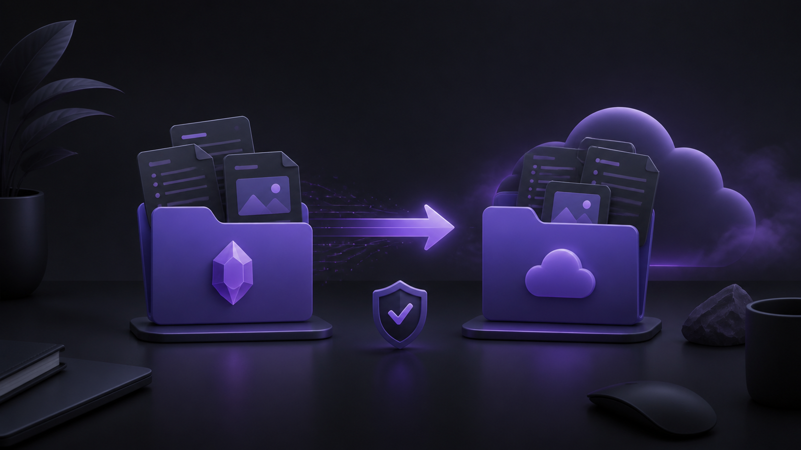
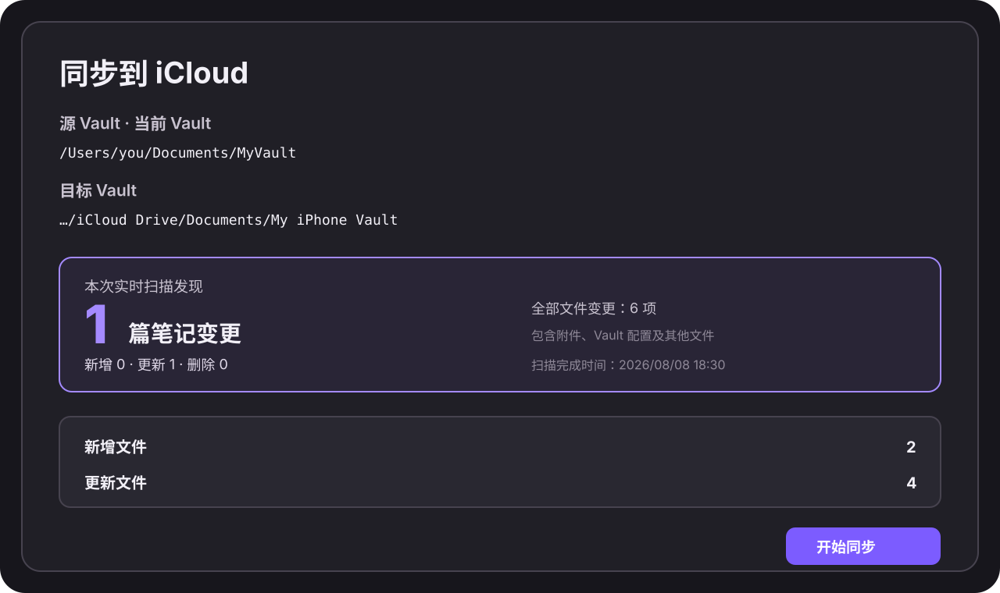

# Vault Mirror

[中文说明](./README.zh-CN.md) · [Safety](./docs/SAFETY.md) · [Privacy](./docs/PRIVACY.md) · [Release guide](./docs/RELEASE.md)



**Vault Mirror** is a macOS Obsidian desktop plugin for a simple multi-device workflow: write in your main Mac vault, mirror it to an iCloud Drive vault, then read it in Obsidian on iPhone.

It is intentionally a **one-way** mirror:

```text
✍️ Mac source vault (source of truth) → ☁️ iCloud Drive destination → 📱 iPhone (view and read)
```

Vault Mirror runs only on your Mac. It does not connect to Baidu Netdisk, iCloud, or any other cloud API. Your existing sync clients remain responsible for moving files between devices.

> [!danger]
> **Back up before your first sync.** Copy or archive your source Vault and any existing iCloud destination Vault before using Vault Mirror. This plugin is a one-way mirror, not a backup tool and not two-way sync. Destination-only files and edits can be overwritten or deleted during the next mirror.

> [!important]
> **Mobile is for viewing.** Treat the iPhone Vault as a read-only copy. Create and edit notes in the Mac source Vault, then run Vault Mirror when you want the latest content on your phone. Editing the iPhone destination can be lost at the next sync.

## 🧭 How the multi-device workflow works

If your primary Vault lives in a desktop sync folder, while your iPhone Vault must live in iCloud Drive, Vault Mirror provides a deliberate, one-way bridge on macOS:

1. ✍️ Open and edit your **primary Vault** in Obsidian on your Mac.
2. ☁️ Select the exact existing **iCloud Drive Vault** as the destination once.
3. 🔍 Run Vault Mirror and review the **fresh live scan**.
4. ✅ Confirm the one-way mirror.
5. 📱 Open the iCloud Vault on iPhone to read the latest notes and attachments.

Vault Mirror copies notes, attachments, hidden files, and `.obsidian` configuration by default. It removes destination-only files only after all creates and updates have completed successfully.

## ✨ Highlights

- 🧠 **Current Vault is the source** — no source path to configure.
- ☁️ **Choose iCloud once** — select an existing local destination, including an iCloud Drive Vault.
- 🔍 **Live preview** — every run scans both folders again; it never reuses an old plan.
- 📝 **Note-first summary** — changed Markdown notes are prominent, with totals for attachments and configuration too.
- 🛡️ **Safe order** — scan → compare → plan → stage copies → update → delete.
- ⚠️ **Deletion safeguards** — large deletions are highlighted; no deletion phase runs after a copy or verification failure.
- 🔄 **Rollback-aware updates** — changed files are staged first and existing destination files are restored if a commit fails.
- ⏳ **Source stability checks** — waits for desktop sync clients to finish creating or removing temporary files.
- 🔒 **Private by design** — no account, telemetry, cloud API, or network transfer.

## Preview and progress

The preview is a fresh scan, not a cached summary. It highlights changed Markdown notes separately from attachments and Vault configuration, and shows the exact source and destination paths before any write occurs.



During a run, Vault Mirror shows the current phase and progress for comparison, copying, updating, verification, and deletion. When the source is still changing, it waits for the filesystem to settle before it creates a plan.

## Installation

### From the Obsidian Community directory

Install **Vault Mirror** from **Settings → Community plugins**, then enable it.

### Manual installation

1. Download `main.js`, `manifest.json`, and `styles.css` from the matching GitHub release.
2. Create this folder inside the vault that will run the plugin:

   ```text
   <Your Vault>/.obsidian/plugins/vault-mirror/
   ```

3. Copy the three downloaded files into that folder.
4. Reload Obsidian.
5. Enable **Vault Mirror** in **Settings → Community plugins**.

## 🚀 First-time setup and daily use

1. 🧳 **Back up both Vaults** before the first run.
2. ✍️ Open the **source Vault** in Obsidian on macOS. It is the only source of truth.
3. ⚙️ Open **Settings → Community plugins → Vault Mirror**.
4. 📁 Under **Destination folder**, select the exact existing iCloud Vault folder—not its parent `Documents` folder.
5. ☁️ Click the cloud-upload Ribbon icon, or run **Vault Mirror: Sync to iCloud** from the Command Palette.
6. 🔍 Wait for the live scan, then check the note count, all-file count, source, destination, and deletion warning.
7. ✅ Select **Start sync** to apply the plan.
8. 📱 Wait for iCloud Drive to finish, then use the iPhone Vault for viewing and reading.

## How mirroring works

For every relative path, Vault Mirror creates one of four operations:

| Source / destination state | Operation |
| --- | --- |
| Exists only in source | Create |
| Exists in both but differs | Update |
| Exists only in destination | Delete |
| Same content | Skip |

All creates and updates are staged before any planned deletion. If a source file disappears while a desktop sync client is working, the plugin re-scans and asks for a new confirmation instead of treating that transient state as a successful mirror.

## Safety model

Vault Mirror refuses to run when:

- source and destination are the same folder;
- either folder is inside the other;
- the destination does not exist or is not writable;
- another Vault Mirror job is already running;
- a symbolic link is encountered;
- the source folder does not settle after repeated checks.

The default exclusion is `.DS_Store`. You can add exact file or folder rules in **Advanced → Excluded files**. `.obsidian` is included by default.

Read the full [safety guide](./docs/SAFETY.md) before using this plugin with a non-empty destination.

## Requirements and limitations

- macOS desktop Obsidian only.
- Obsidian 1.5.0 or later.
- The destination must already exist.
- One-way mirror only; no conflict resolution and no destination-to-source writes.
- No automatic file watching or scheduled sync in this release.
- Destination-side iPhone edits and device-specific `.obsidian` files may appear as changes on the next preview. This is expected for a mirror whose source is authoritative.

## Privacy

Vault Mirror operates on local filesystem paths only. It does not send vault content, paths, metadata, analytics, or credentials to any service. See [Privacy](./docs/PRIVACY.md).

## Development

```bash
pnpm install
pnpm test
pnpm build
```

The production build creates `main.js` in the repository root. The test suite covers creation, update, deletion, nested folders, binary files, `.obsidian`, path safety, concurrent jobs, source changes during staging, and note-change counting.

## Release

For each release, keep the Git tag exactly equal to the version in `manifest.json`, then attach these files to the GitHub release:

- `main.js`
- `manifest.json`
- `styles.css`

See the [release guide](./docs/RELEASE.md) for the full checklist.

## License

[MIT](./LICENSE)
